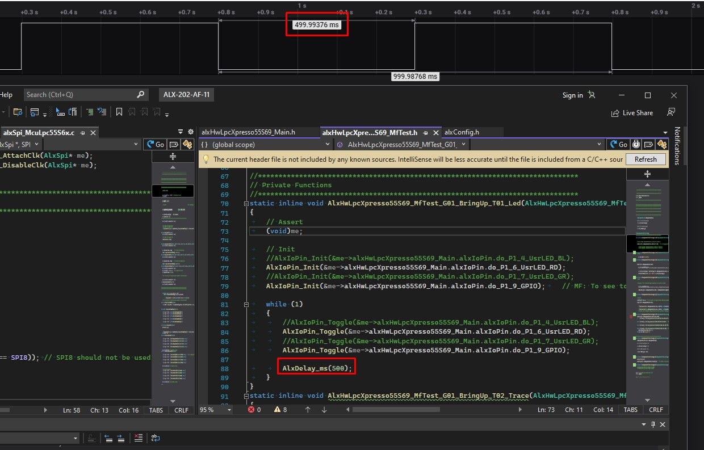
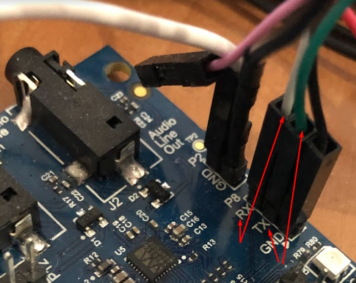

# __Auralix C Library - ALX HW LPC Xpresso 55S69 MF Test Module__

## __G01_BringUp__
- Bring Up of Alx modules

### __Test List__  
- __AlxHwLpcXpresso55S69_MfTest_G01_BringUp_T01_Led(me)__
	- 

- __AlxHwLpcXpresso55S69_MfTest_G01_BringUp_T02_Trace(me)__
	-  

- __AlxHwLpcXpresso55S69_MfTest_G01_BringUp_T03_Adc(me)__
	- [Get V on IoPin P0_23 AlxCh0 and IoPin P0_16 AlxCh8](Img/AlxHwLpcXpresso55S69_MfTest_G01_BringUp_T02_Trace_01.jpg) 

- __AlxHwLpcXpresso55S69_MfTest_G01_BringUp_T04_Pwm(me)__

- __AlxHwLpcXpresso55S69_MfTest_G01_BringUp_T05_Spi(me)__

- __AlxHwLpcXpresso55S69_MfTest_G01_BringUp_T06_Clk(me)__
