# ALX HW LPCXpresso55S69 Development Board Home
---

## Youtube
---
    - [Start Guide]()

## HW
---
- Development Board Links
    - [Web](https://www.nxp.com/design/development-boards/lpcxpresso-boards/lpcxpresso55s69-development-board:LPC55S69-EVK)
    - [Sch](WikiFiles/Pdf/LPCXpresso55S69_Board_Schematic_RevA2_dec4.pdf)
    - [User Guide](WikiFiles/Pdf/UM11158.pdf)
- MCU Links
    - [Datasheet](../Mcu/McuLpc/WikiFiles/LPC55S6x_Datasheet.pdf)
    - [User Manual](../Mcu/McuLpc/WikiFiles/UM11126_LPC55S6x_LPC55S2x_LPC552x_UserManual.pdf)
    - MCU on board is:
        - LPC55S69JBD100E
        - LPC55S69JBD100K
        - LPC55S69JBD100Y
- Board Connection Notes
    - Erased MCU consumption @3V3 = 4mA
	- P8 Header UART_RX should be connected to your PC's UART_RX!
	- Remove default jumper on P4 and just connect 3V3 on middle pin-2

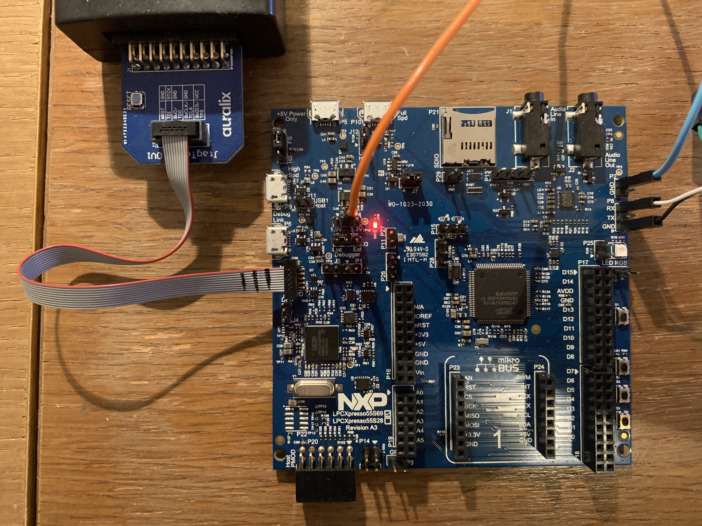

## SW - Relevant Repositories
---
- [ALX-202-AF-10-8_Lpc55s69Sdk - 0.1.0](https://bitbucket.org/-auralix-/alx-202-af-10-8_lpc55s69sdk/commits/tag/0.1.0)
- [ALX-202-AF-11_LpcXpresso55S69_C](https://bitbucket.org/-auralix-/alx-202-af-11_lpcxpresso55s69_c/src/master/)

## SW - IDE
---
- Tested with VisualGDB's GCC 10.3.1 -> Use exactly this version of compiler
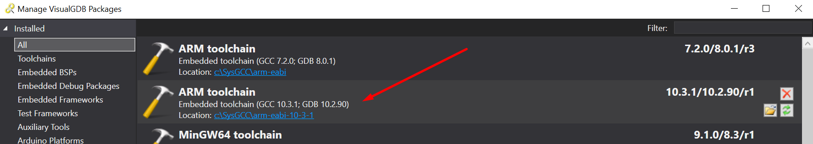

- Tested with J-Link Driver version 6.62d (it must relative newer driver because its new MCU)
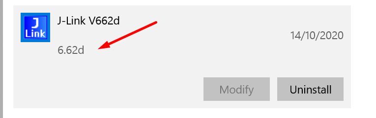

- VisualDGB Project Creation Steps
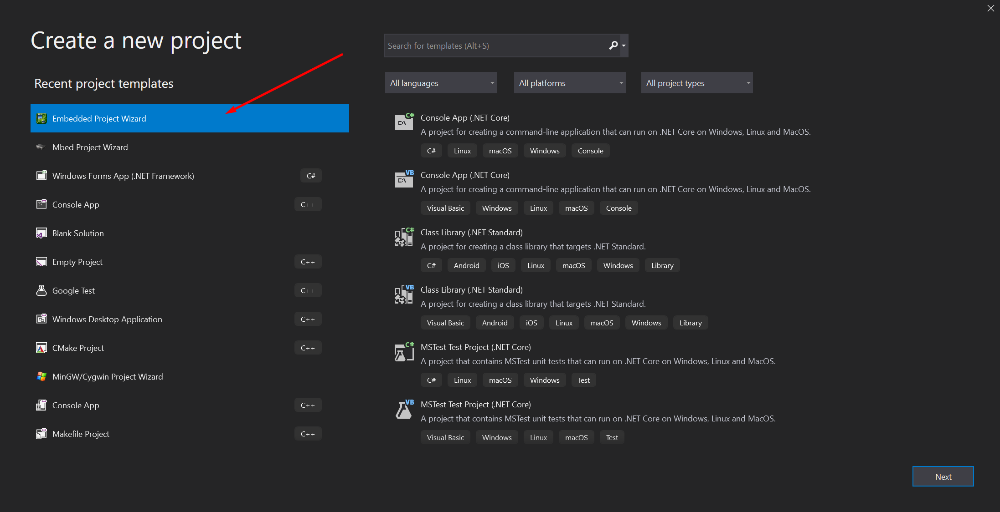
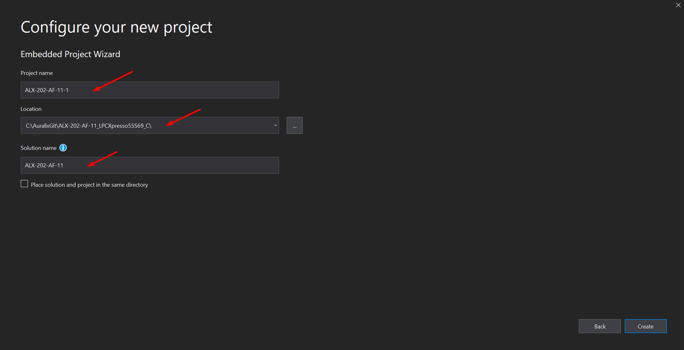
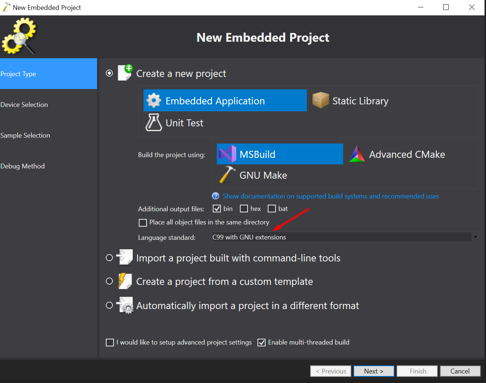
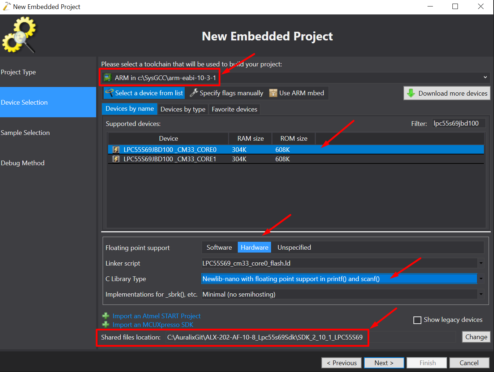
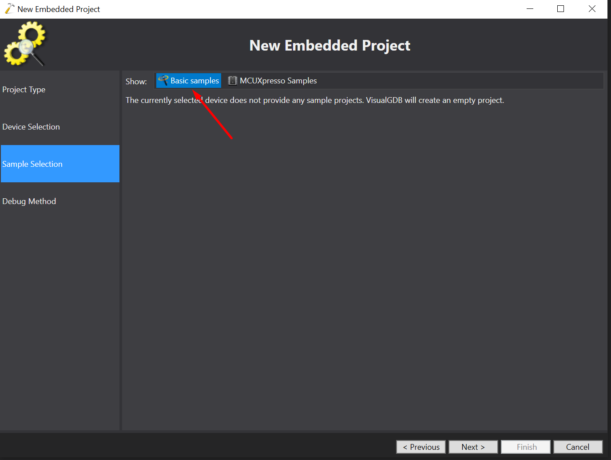
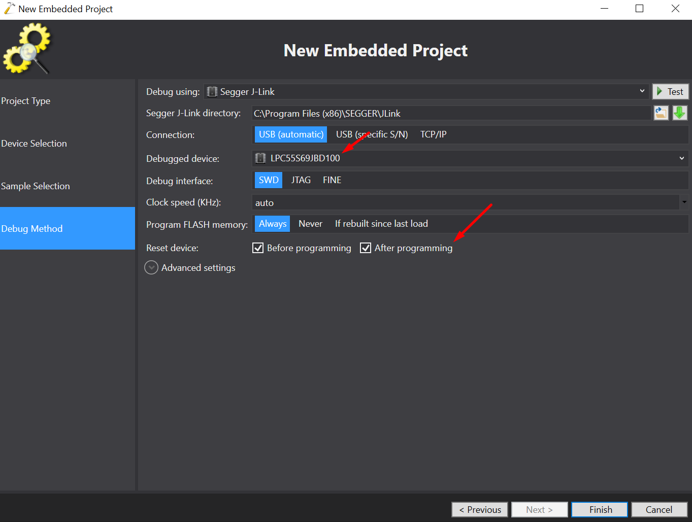
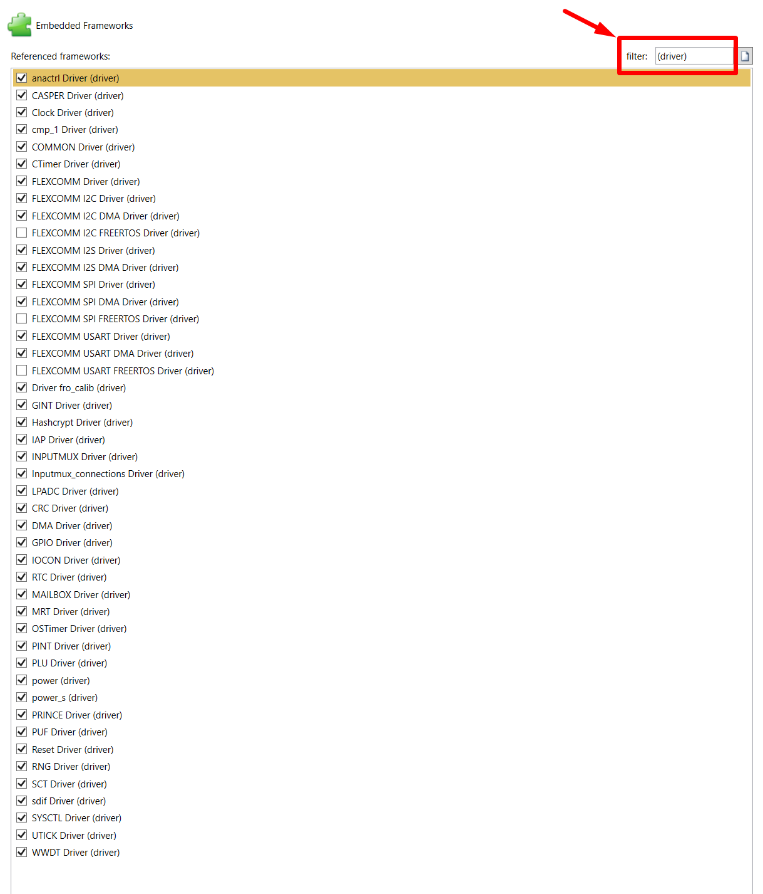
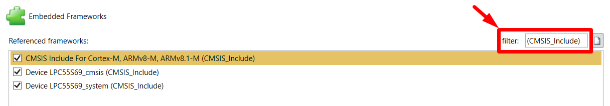
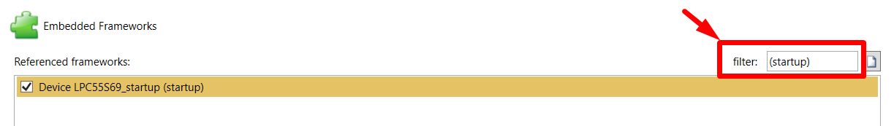
