# ALX HW LPCXpresso55S69 Development Board Home
---
- MF: - Pin PIO1_7 (LED Green) is not routed to P18 position 7 as it says in *LPCXpresso55S69_Board_Schematic_RevA2_dec4.pdf*
- If you __erase FLASH__, with J-Flash Lite, then you can not connect with VisualGDB standard settings, also J-Flash Lite stops working
    - You need to __disable connect under reset__ in VisualGDB settings, then MCU becomes alive
    - After that, you can turn on back this feature, it seems when some code is on FLASH, everything works OK

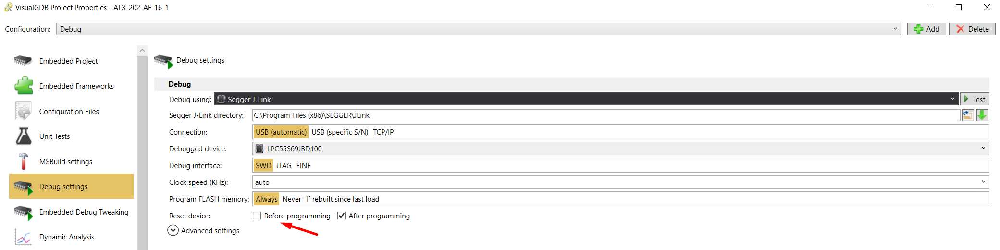

## Youtube
---
- [ALX-202-SW-VID-3--AlxHwLpcXpresso55S69_StartGuide](https://youtu.be/_WEcMA0Qp60)

## HW
---
- MCU On Board
    - LPC55S69JBD100E
    - LPC55S69JBD100K
    - LPC55S69JBD100Y
- Board Connection Notes
    - Erased MCU consumption @3V3 = 4mA
	- P8 Header UART_RX should be connected to your PC's UART_RX!
	- Remove default jumper on P4 and just connect 3V3 on middle pin-2

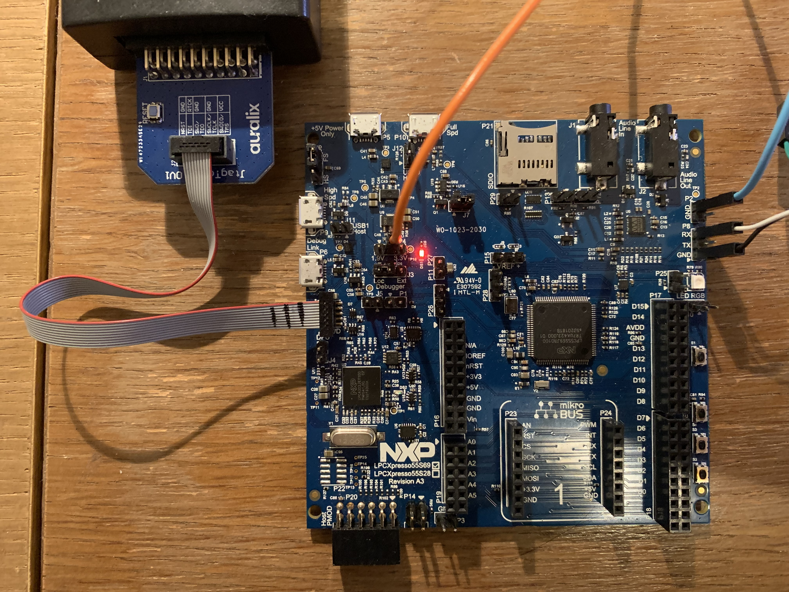

## SW - Relevant Repositories
---
- [ALX-202-AF-10-8_Lpc55s69Sdk - 0.1.0](https://bitbucket.org/-auralix-/alx-202-af-10-8_lpc55s69sdk/commits/tag/0.1.0)
- [ALX-202-AF-11_LpcXpresso55S69_C](https://bitbucket.org/-auralix-/alx-202-af-11_lpcxpresso55s69_c/src/master/)
- [ALX-202-AF-16_LpcXpresso55S69_FreeRtos_C](https://bitbucket.org/-auralix-/alx-202-af-16_lpcxpresso55s69_freertos_c/src/master/)

## SW - IDE - Bare-metal
---
- Tested with VisualGDB's GCC 10.3.1 -> Use exactly this version of compiler

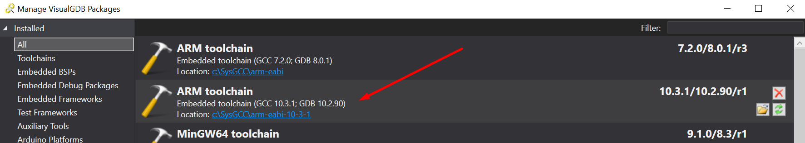

- Tested with J-Link Driver version 6.62d (it must relative newer driver because its new MCU)

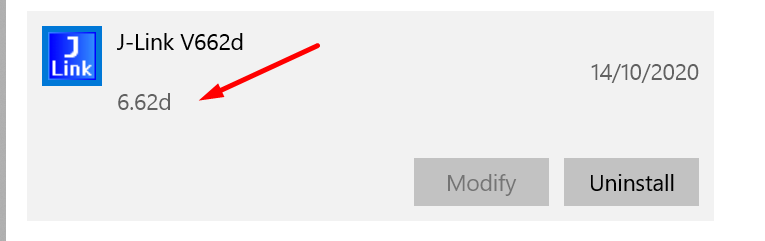

- VisualDGB Project Creation Steps

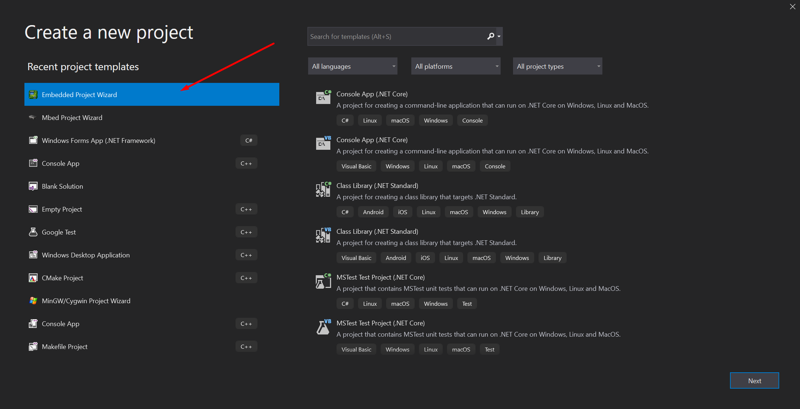
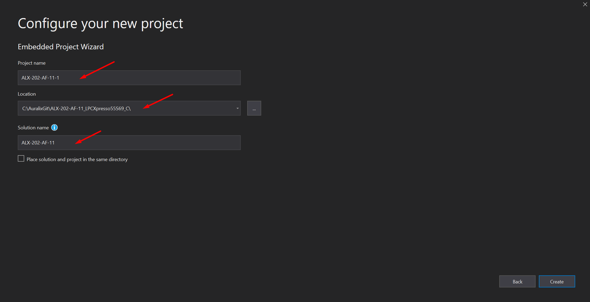
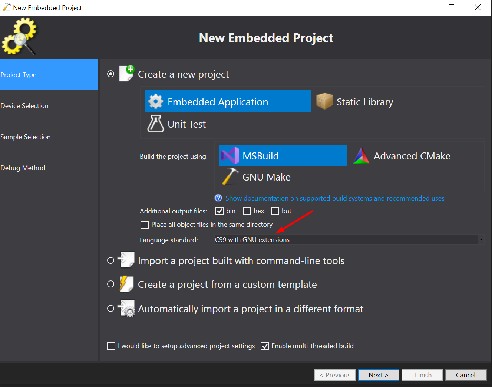
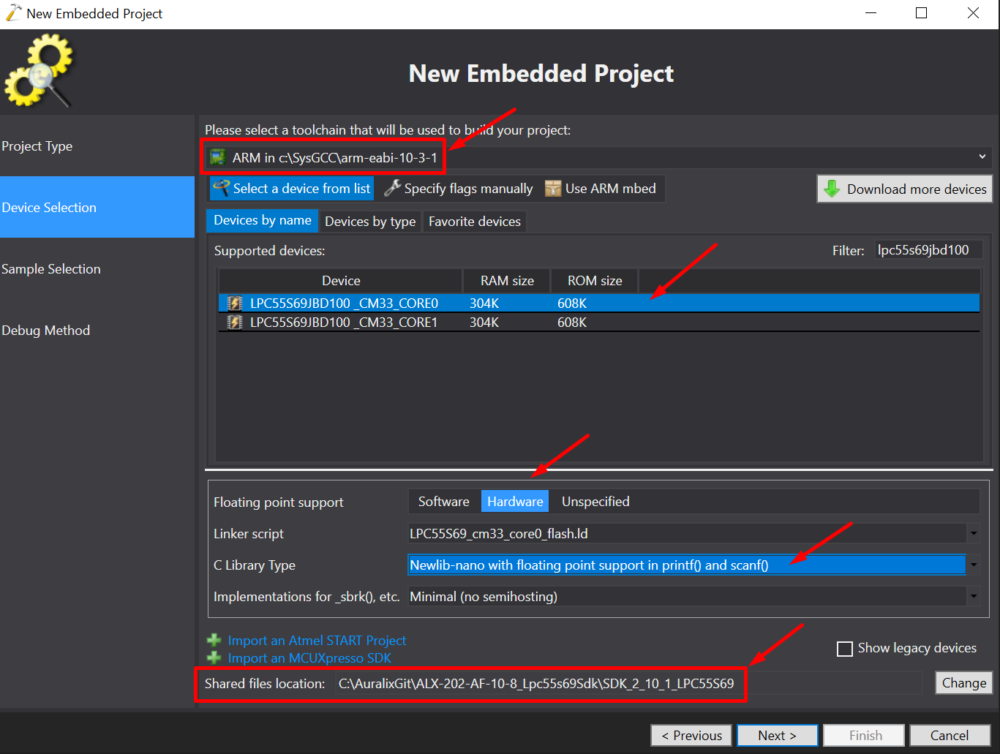
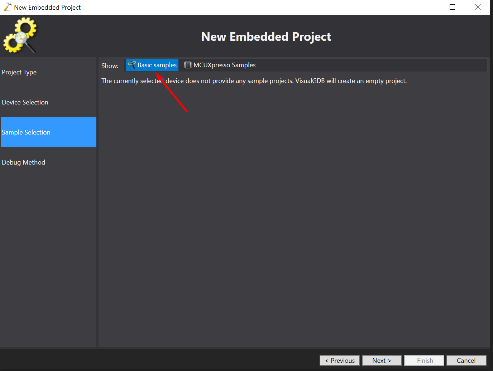
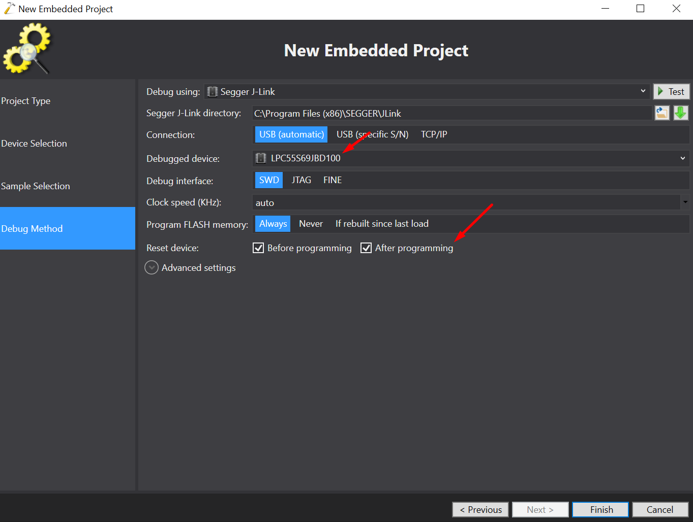
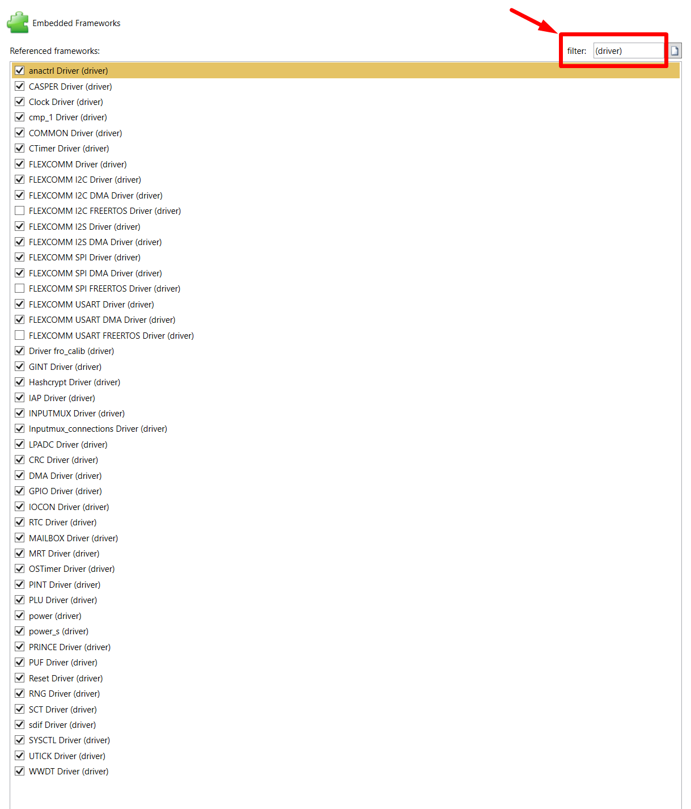
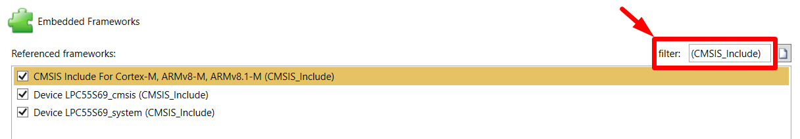
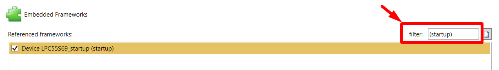

## SW - IDE - freeRTOS with Heap_1
---
- Everything specified above for bare-metal project
- Used this [FreeRTOSConfig.h](https://bitbucket.org/-auralix-/alx-202-af-10-8_lpc55s69sdk/src/master/SDK_2_10_1_LPC55S69/rtos/freertos/template/ARM_CM33/FreeRTOSConfig.h)
    - NOTE that Heap_1 schema is not explicitly defined in configFreeRTOS.h
        - In example projects there was Heap schema explicitly defined, we need to investigate this further

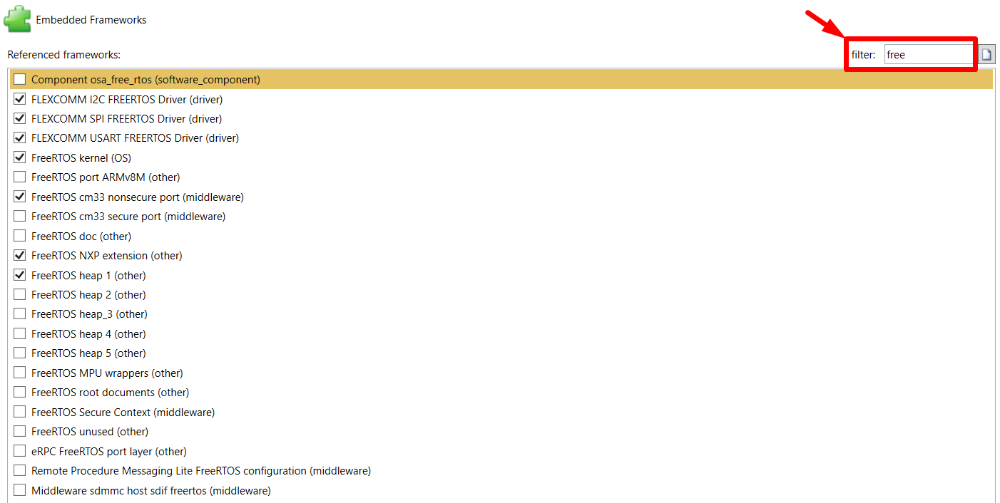
