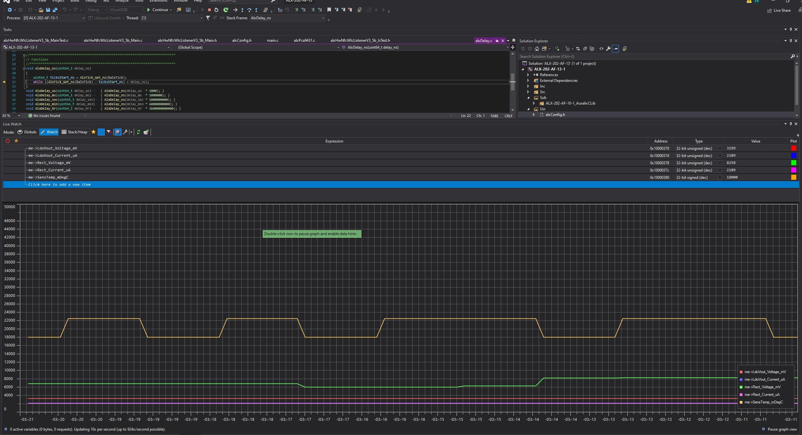
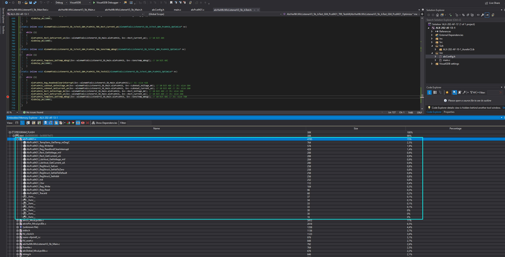

# Auralix C Library - ALX HW NFC WLC Listener V3_5b JS Test Module
---
## __G01_BringUp__
---
Everything is according to new testing system

## __G02_Pca9431__
---
- Testing I2c Functions using PCA9431
- More : - [alxHwNucleoF429Zi_JsTest - ALX HW Nucleo-F429ZI JS Test Module](../../Hw/HwNucleoF429Zi/Test/alxWiki_alxHwNucleoF429Zi_JsTest.md)

## __G03_Crn120__
---
- Testing I2c Functions using CRN120
- Tested by Nucleo not LPC804
- More : - [alxHwNucleoF429Zi_JsTest - ALX HW Nucleo-F429ZI JS Test Module](../../Hw/HwNucleoF429Zi/Test/alxWiki_alxHwNucleoF429Zi_JsTest.md)

## __G04_Pca9431_Optimize__
---

### __Configurations__
- __AlxCk__: AlxClk_Config_McuLpc80x_FroOsc_30MHz_Mainclk_15MHz_CoreSysClk_15MHz
- __AlxTrace__: AlxGlobal_BaudRate_115200
- __AlxI2c__: AlxI2c_Clk_McuLpc80x_BitRate_400kHz

### __Test List__ 
- __AlxHwNfcWlcListenerV3_5b_JsTest_G04_Pca9431_T01_ReadAndClearInterrupt(me)__
	- /
- __AlxHwNfcWlcListenerV3_5b_JsTest_G04_Pca9431_T02_LdoVout_GetVoltage_mV(me)__
	- /
- __AlxHwNfcWlcListenerV3_5b_JsTest_G04_Pca9431_T03_LdoVout_GetCurrent_uA(me)__
	- /
- __AlxHwNfcWlcListenerV3_5b_JsTest_G04_Pca9431_T04_Rect_GetVoltage_mV(me)__
	- /
- __AlxHwNfcWlcListenerV3_5b_JsTest_G04_Pca9431_T05_Rect_Current_uA(me)__
	- /
- __AlxHwNfcWlcListenerV3_5b_JsTest_G04_Pca9431_T06_SensTemp_mDegC(me)__
	- /
- __AlxHwNfcWlcListenerV3_5b_JsTest_G04_Pca9431_T99_TestAll(me)__
	- Adc Conversion into mV, uA and mdegC
	- 
	- PcaLibSpace
	- 

---
---
# __[alxWiki_Home](../../../alxWiki_Home.md)__

# __[alxWiki_alxPca9431.md](../../Ext/alxWiki_alxPca9431)__
