# Auralix C Library - ALX HW NFC WLC Listener V3_5b MF Test Module

## __G01_BringUp__
---
Everything is according to new testing system

## __G02_I2cCrn120__
---
- Testing I2c Functions using CRN120

### __Configurations__
- __AlxCk__: AlxClk_Config_McuLpc80x_FroOsc_30MHz_Mainclk_15MHz_CoreSysClk_15MHz
- __AlxTrace__: AlxGlobal_BaudRate_115200
- __AlxI2c__: AlxI2c_Clk_McuLpc80x_BitRate_400kHz

### __Test List__ 
- __AlxHwNfcWlcListenerV3_5b_Main_MfTest_G02_I2cCrn120_T01_Led(me)__
	- /
- __AlxHwNfcWlcListenerV3_5b_Main_MfTest_G02_I2cCrn120_T02_IsSlaveReady(me)__
	- When NACK is returned
	- 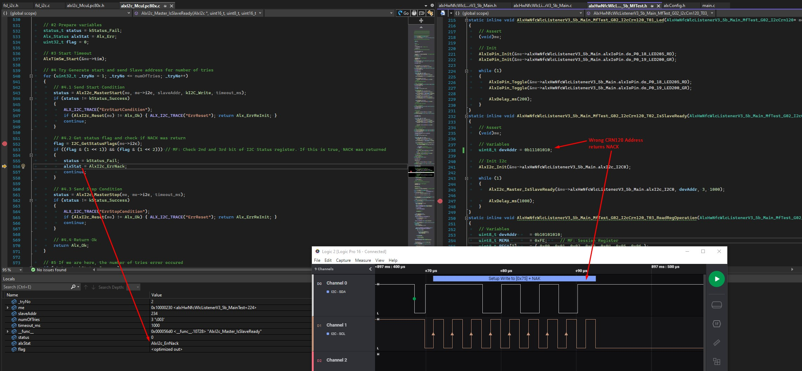
	- When ACK is returned
	- 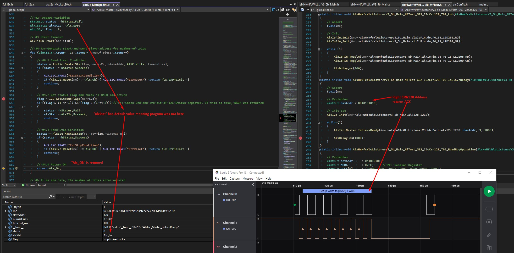
- __AlxHwNfcWlcListenerV3_5b_Main_MfTest_G02_I2cCrn120_T03_ReadRegOperation(me)__
	- 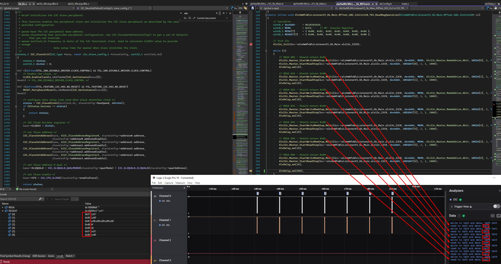
- __AlxHwNfcWlcListenerV3_5b_Main_MfTest_G02_I2cCrn120_T04_ReadOperation(me)__
	- 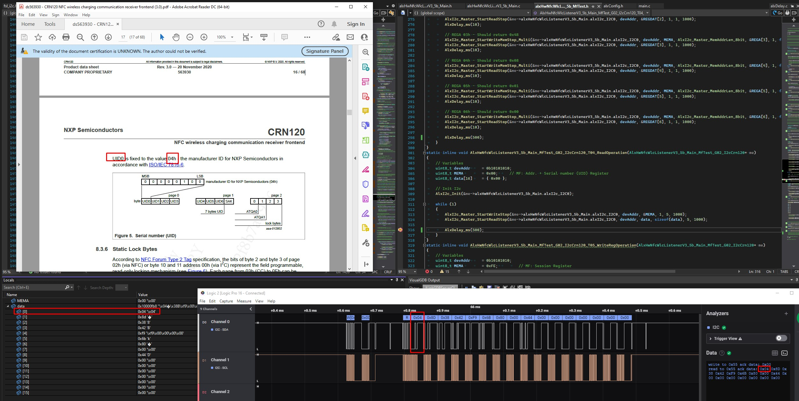
- __AlxHwNfcWlcListenerV3_5b_Main_MfTest_G02_I2cCrn120_T05_WriteRegOperation(me)__
	- 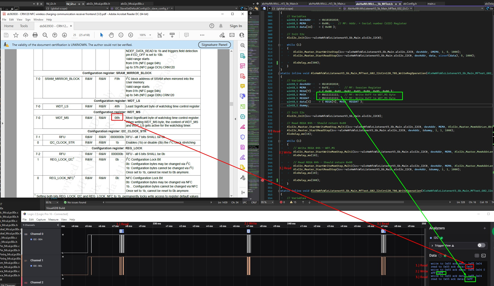
- __AlxHwNfcWlcListenerV3_5b_Main_MfTest_G02_I2cCrn120_T06_WriteOperation(me)__
	- 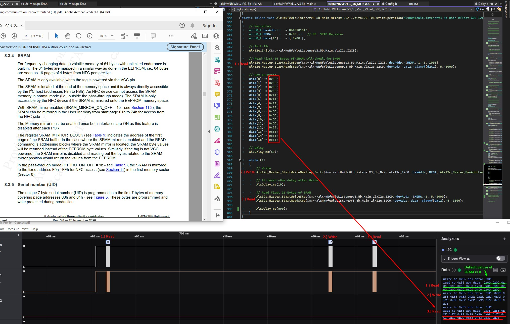

## __G03_AlxCrn120__
---
- Testing ALX CRN120 Module

### __Configurations__
- __AlxCk__: AlxClk_Config_McuLpc80x_FroOsc_30MHz_Mainclk_15MHz_CoreSysClk_15MHz
- __AlxTrace__: AlxGlobal_BaudRate_115200
- __AlxI2c__: AlxI2c_Clk_McuLpc80x_BitRate_400kHz

### __Test List__ 
- __AlxHwNfcWlcListenerV3_5b_Main_MfTest_G03_AlxCrn120_T01_Led(me)__
	- /
- __AlxHwNfcWlcListenerV3_5b_Main_MfTest_G03_AlxCrn120_T02_IsSlaveReady(me)__
	- /
- __AlxHwNfcWlcListenerV3_5b_Main_MfTest_G03_AlxCrn120_T03_ReadUsrMem(me)__
	- /
- __AlxHwNfcWlcListenerV3_5b_Main_MfTest_G03_AlxCrn120_T04_ModuleReadReg(me)__
	- 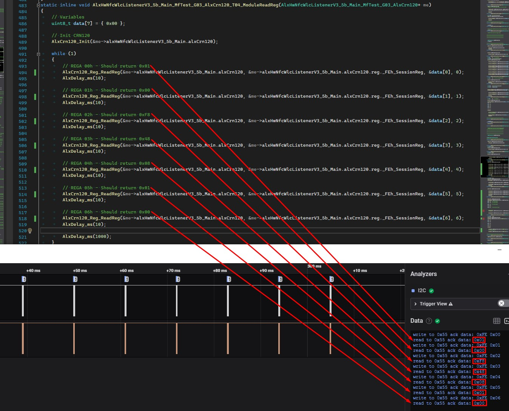
- __AlxHwNfcWlcListenerV3_5b_Main_MfTest_G03_AlxCrn120_T05_ModuleWriteReg(me)__
	- 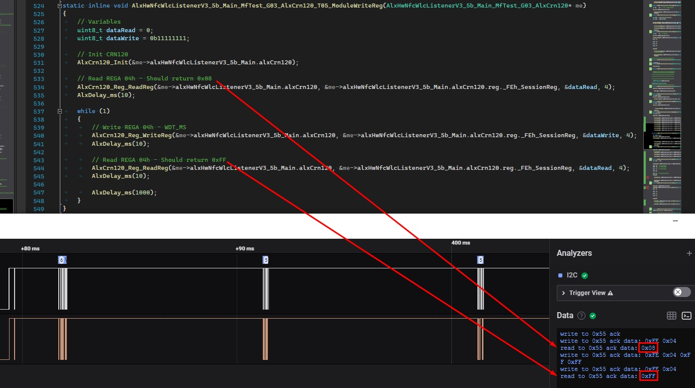
- __AlxHwNfcWlcListenerV3_5b_Main_MfTest_G03_AlxCrn120_T06_ModuleRead(me)__
	- 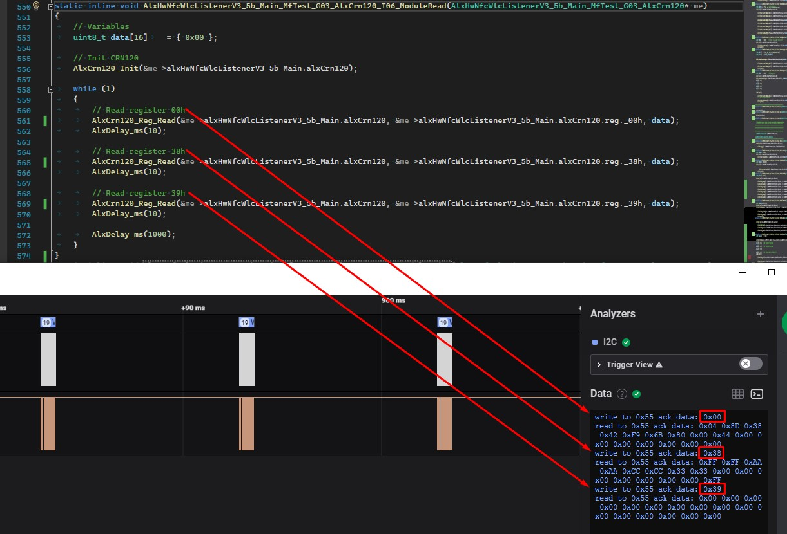
- __AlxHwNfcWlcListenerV3_5b_Main_MfTest_G03_AlxCrn120_T07_ModuleWrite(me)__
	- 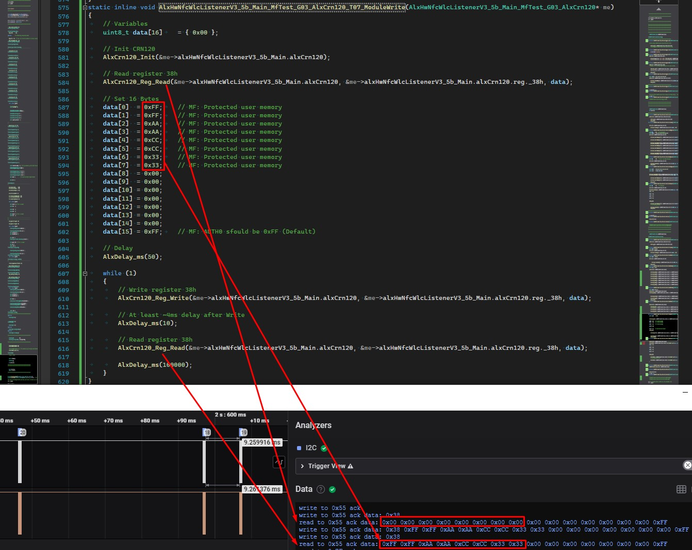
	- Since values were written to User Memory (EEPROM), values remain even after POR
	- 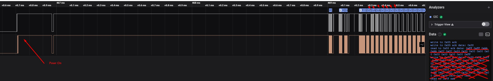
- __AlxHwNfcWlcListenerV3_5b_Main_MfTest_G03_AlxCrn120_T08_ModuleSramRead(me)__
	- /
- __AlxHwNfcWlcListenerV3_5b_Main_MfTest_G03_AlxCrn120_T09_ModuleSramWrite(me)__
	- 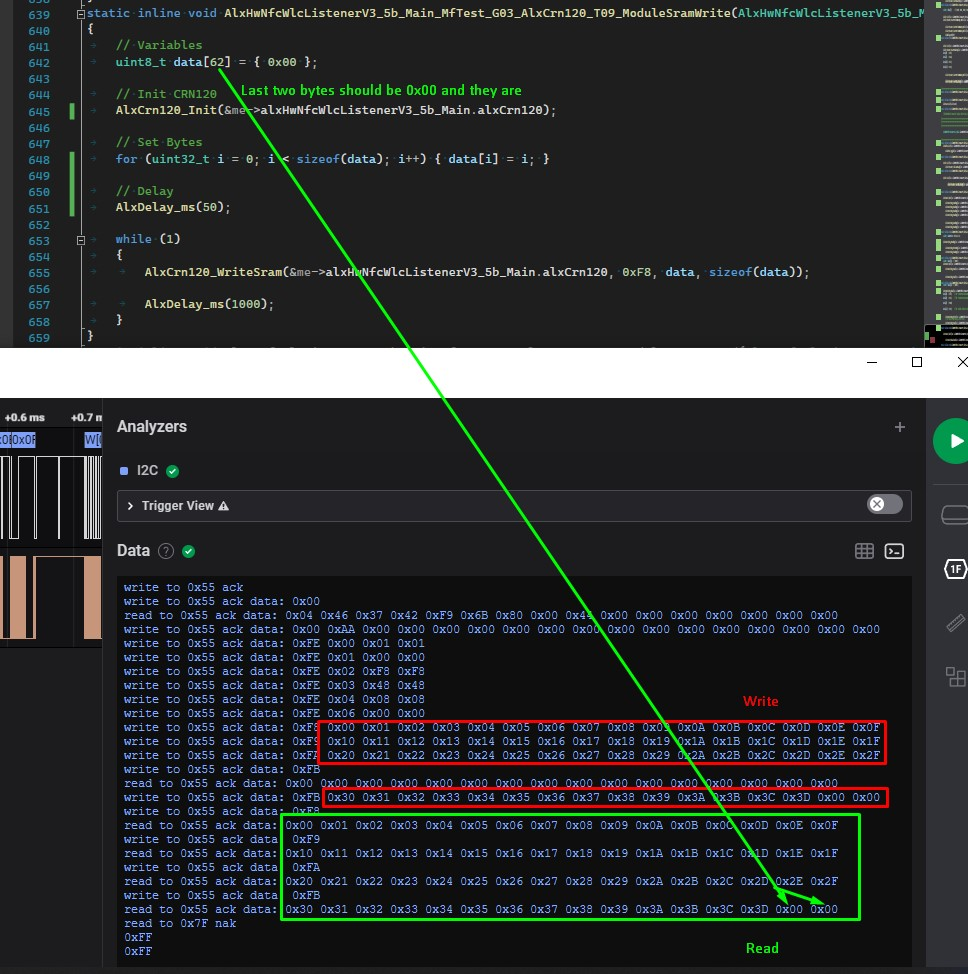
- __AlxHwNfcWlcListenerV3_5b_Main_MfTest_G03_AlxCrn120_T10_ModuleEepromRead(me)__
	- /
- __AlxHwNfcWlcListenerV3_5b_Main_MfTest_G03_AlxCrn120_T11_ModuleEepromWrite(me)__
	- 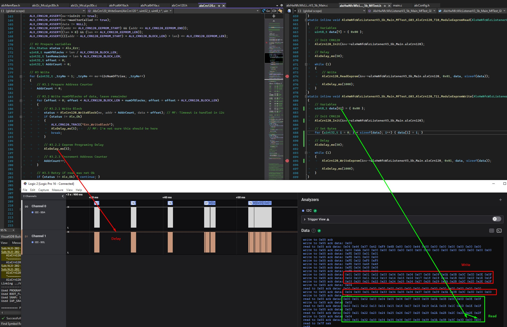

## __G04_AlxWlcl__
---
- The goal is to achieve that AlxWlcl works the same as Cili

### __Configurations__
- __AlxCk__: AlxClk_Config_McuLpc80x_FroOsc_30MHz_Mainclk_15MHz_CoreSysClk_15MHz
- __AlxTrace__: AlxGlobal_BaudRate_115200
- __AlxI2c__: AlxI2c_Clk_McuLpc80x_BitRate_400kHz

### __Test List__ 
- __AlxHwNfcWlcListenerV3_5b_Main_MfTest_G04_AlxWlcl_T01_WriteCcAndNdef(me)__
	- /
- __AlxHwNfcWlcListenerV3_5b_Main_MfTest_G04_AlxWlcl_T02_SetBat(me)__
	- /
- __AlxHwNfcWlcListenerV3_5b_Main_MfTest_G04_AlxWlcl_T03_CiliExample(me)__
	- 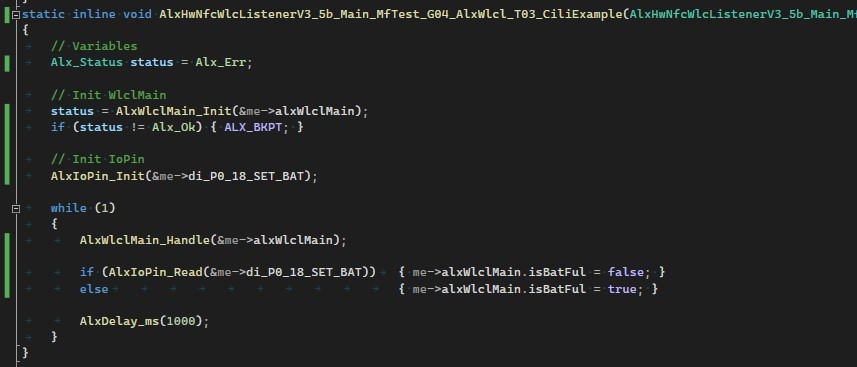
	- Pin PIO0_18 set HIGH to simulate Satatic Charging
	- 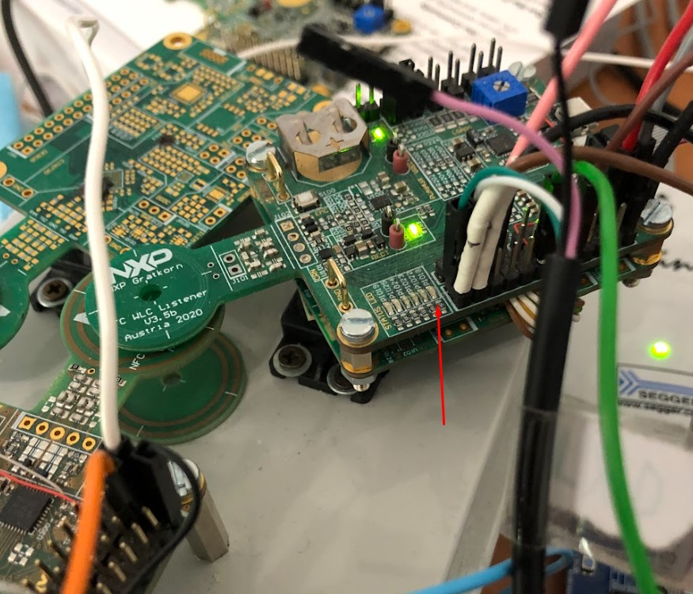
	- 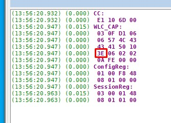
	- Pin PIO0_18 set LOW to simulate Battery Full
	- 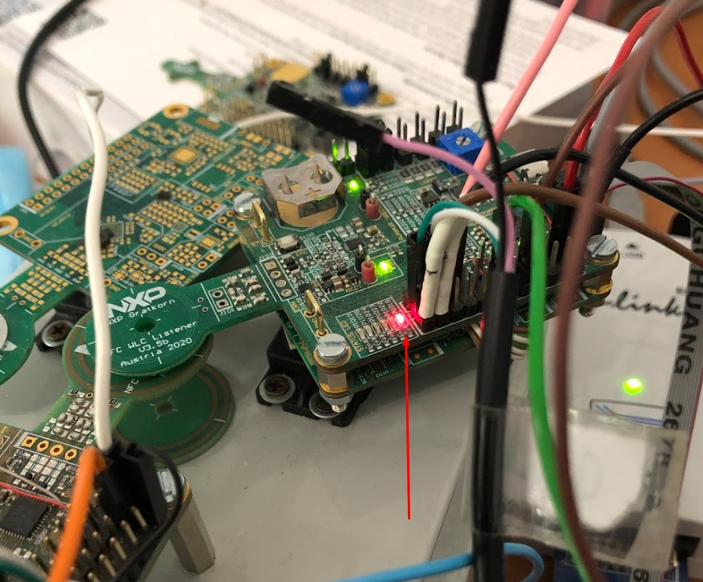
	- 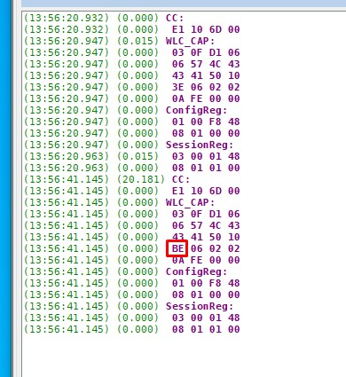