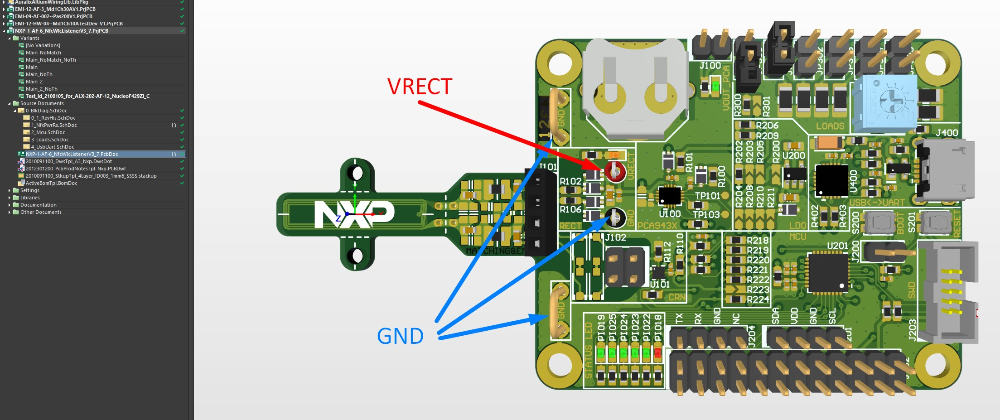
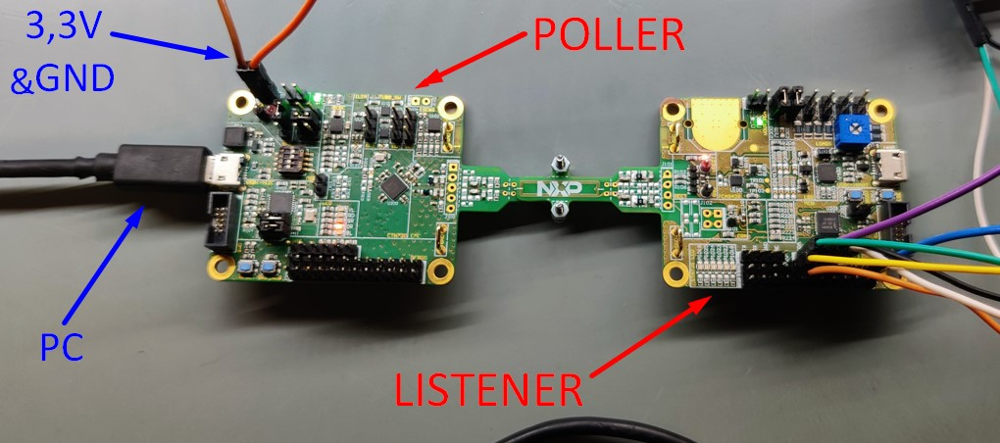
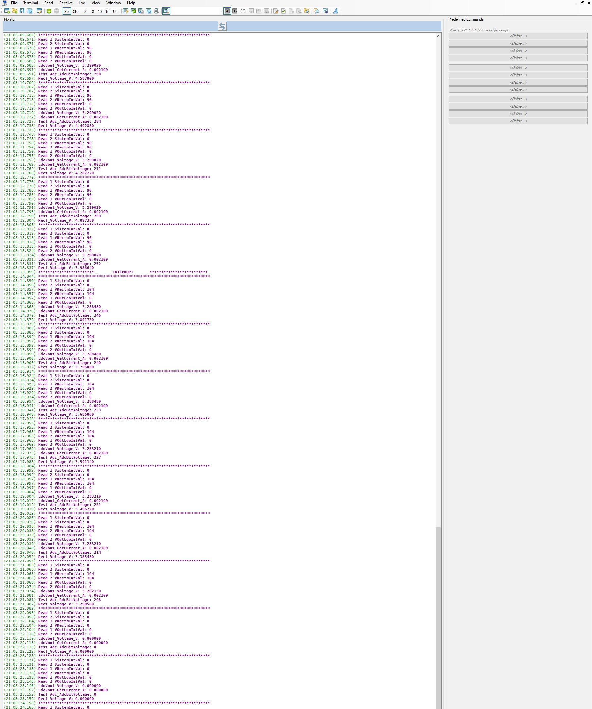
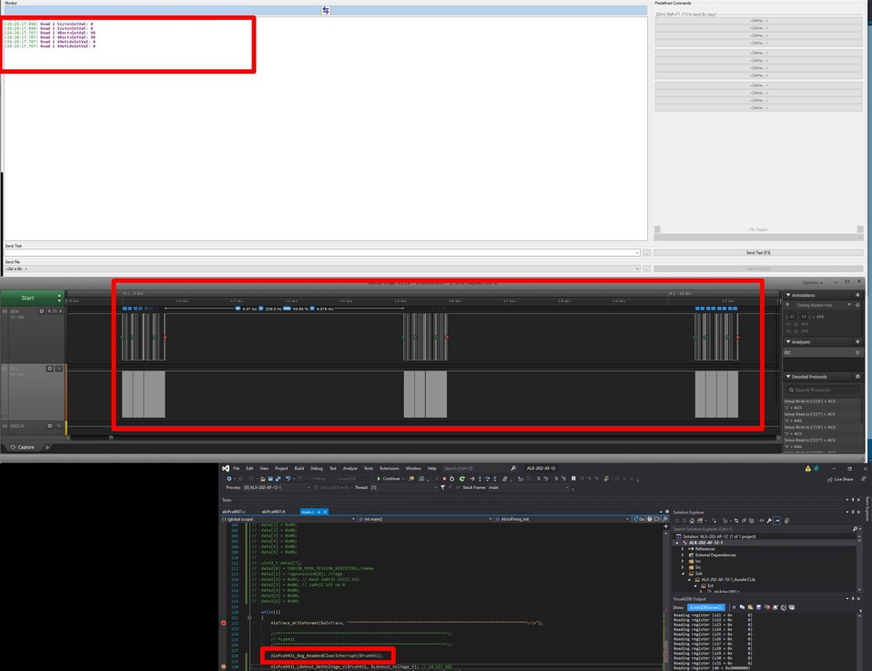
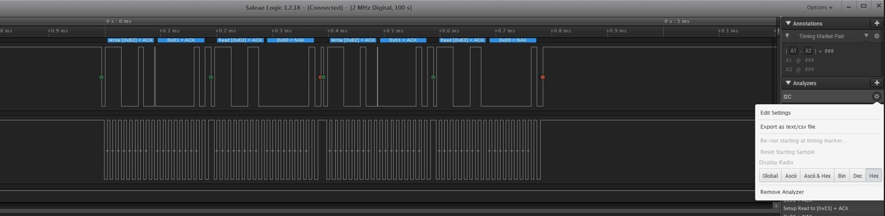
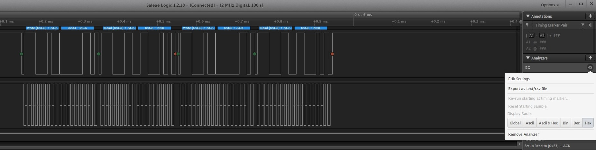
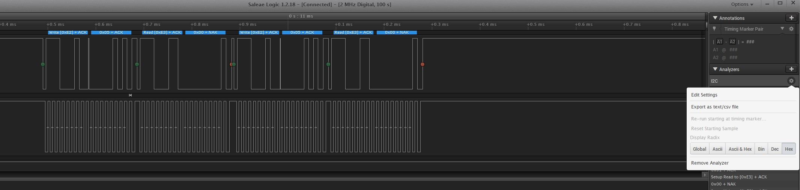
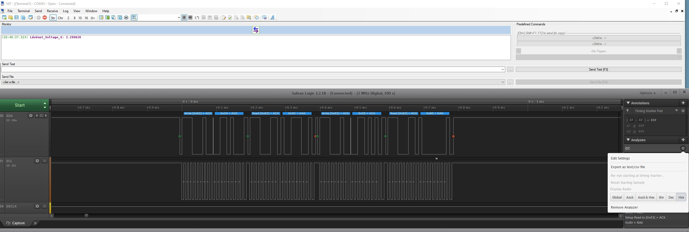
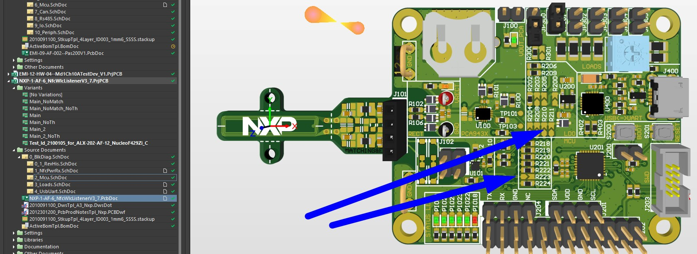

# Auralix C Library - ALX HW Nucleo-F429ZI JS Test Module 

##G01_BringUp
- Test List
	- AlxHwNucleoF429Zi_JsTest_G01_BringUp_T01_Led
	- AlxHwNucleoF429Zi_JsTest_G01_BringUp_T02_Trace

##G02_Pca9431
- This test group contains tests for testing Pca9431
### **Used HW PCBs**
- HwNfcWlcListenerV3_7	--[ID2100105](https://auralix.eu.teamwork.com/#/tasks/25808230)  
- HwNfcWlcPollerV3_7	--[ID2100138](https://auralix.eu.teamwork.com/#/tasks/25808264)  
- Nucleo-F429ZI			--[ID2100212](https://auralix.eu.teamwork.com/#/tasks/25927281)  

### **Supply of PCA9431 on HwNfcWlcListenerV3_7**  
- PCA9431 must be supplied on pin VRECT  
	- Minimum voltage 4V on pin VRECT, but to everything inside PCA9431 work normally need at least 5V (LDO output could be 5V)  
	- Recommended supplied voltage is 6V on pin VRECT  
	- Maximum supplied voltage is 12V on pin VRECT  
	- 2 options to achieve that:  
		- **a)**  
			- connect 5-12V from power-supply to red header (VRECT) on NXP WLC Listener board  
			- GND from power-supply to black header (GND) or to GND Busbar on NXP WLC Listener board  
  
		- **b)**  
			- add 3-5V power supply on NXP WLC Poller and put together both antennas (Listener and Poller)  
			- (so supply on should between Listener between 3-12V- depends on type of antenna,distance,matching...)  
### **Connection between HW**  
#### Connection between HwNfcWlcPollerV3_7 and HwNfcWlcListenerV3_7
- chosen option **b)** of Supply of PCA9431 on HwNfcWlcListenerV3_7  
	- add 3-5V power supply on NXP WLC Poller and put together both antennas (Listener and Poller)  
  
		
#### Connection between **HwNfcWlcListenerV3_7** and **Nucleo-F429ZI**  
-i2c -- Scl  
	- J201_pin 4 -- I2C.SCL on HwNfcWlcListenerV3_7 [white wire](../../../Img/test_HwNucleoF429Zi_HwNfcWlcListenerV3_7/Connection_HwWlcListenerV3_7.jpg)  
	- pin PB10 on Nucleo-F429ZI [white wire](../../../Img/test_HwNucleoF429Zi_HwNfcWlcListenerV3_7/Nucleo-F429ZI.jpg)  
-i2c -- Sda  
	- J201_pin 1 -- I2C.SDA on HwNfcWlcListenerV3_7 [green wire](../../../Img/test_HwNucleoF429Zi_HwNfcWlcListenerV3_7/Connection_HwWlcListenerV3_7.jpg)  
	- pin PB10 on Nucleo-F429ZI [green wire](../../../Img/test_HwNucleoF429Zi_HwNfcWlcListenerV3_7/Nucleo-F429ZI.jpg)  
- GND  
	- J201_pin 3 -- GND on HwNfcWlcListenerV3_7 [black wire](../../../Img/test_HwNucleoF429Zi_HwNfcWlcListenerV3_7/Connection_HwWlcListenerV3_7.jpg)  
	- one of GND pins on Nucleo-F429ZI [black wire](../../../Img/test_HwNucleoF429Zi_HwNfcWlcListenerV3_7/Nucleo-F429ZI.jpg)  
-interrupt  
	- J202_pin 10 -- PCA943X_nINT on HwNfcWlcListenerV3_7 [yellow wire](../../../Img/test_HwNucleoF429Zi_HwNfcWlcListenerV3_7/Connection_HwWlcListenerV3_7.jpg)  
	- pin PC3 on Nucleo-F429ZI [yellow wire](../../../Img/test_HwNucleoF429Zi_HwNfcWlcListenerV3_7/Nucleo-F429ZI.jpg)  
-sleep-EN  
	- J202_pin 9 -- PCA943X_EN n HwNfcWlcListenerV3_7 [orange wire](../../../Img/test_HwNucleoF429Zi_HwNfcWlcListenerV3_7/Connection_HwWlcListenerV3_7.jpg)  
	- pin PA9 on Nucleo-F429ZI [orange wire](../../../Img/test_HwNucleoF429Zi_HwNfcWlcListenerV3_7/Nucleo-F429ZI.jpg)  
#### I2c pull up  
-i2c--pull up **in this case connected to power-supply**  
	-	J201_pin 2 -- VDD_PULL on HwNfcWlcListenerV3_7 [purple wire](../../../Img/test_HwNucleoF429Zi_HwNfcWlcListenerV3_7/Connection_HwWlcListenerV3_7.jpg)  
	-	J202_pin 24 -- GND on HwNfcWlcListenerV3_7 [blue wire](../../../Img/test_HwNucleoF429Zi_HwNfcWlcListenerV3_7/Connection_HwWlcListenerV3_7.jpg)  
		
#### Connection to saleae logic analyzer  
- Ch 0 -> I2C.SDA [green wire](../../../Img/test_HwNucleoF429Zi_HwNfcWlcListenerV3_7/alxWiki_alxHwNucleoF429Zi_JsTest_AllHw.jpg)  
- Ch 1 -> I2C.SCL [white wire](../../../Img/test_HwNucleoF429Zi_HwNfcWlcListenerV3_7/alxWiki_alxHwNucleoF429Zi_JsTest_AllHw.jpg)  
- GND  -> [black wire](../../../Img/test_HwNucleoF429Zi_HwNfcWlcListenerV3_7/alxWiki_alxHwNucleoF429Zi_JsTest_AllHw.jpg)  
	
### **Tests**

#### AlxPca9431_Init(&Pca9431)  
- 1) Init GPIO  
- 2) Init I2C  
- 4) Set registers values to default [i2c_AlxPca9431_Init_SetToDefault](../../../Img/test_HwNucleoF429Zi_HwNfcWlcListenerV3_7/i2c_AlxPca9431_Init_SetToDefault.jpg)  
- 6) Set registers values - WEAK [AlxPca9431_RegStruct_SetVal](../../../Img/test_HwNucleoF429Zi_HwNfcWlcListenerV3_7/i2c_AlxPca9431_Init_SetSpecificReg.jpg)  
- 7) Write registers  
	- [AlxPca9431_Init_dec](../../../Img/test_HwNucleoF429Zi_HwNfcWlcListenerV3_7/i2c_AlxPca9431_Init_dec.jpg)  
	- [AlxPca9431_Init_hex_1/2](../../../Img/test_HwNucleoF429Zi_HwNfcWlcListenerV3_7/i2c_AlxPca9431_Init_hex_1.jpg)  
	- [AlxPca9431_Init_hex_2/2](../../../Img/test_HwNucleoF429Zi_HwNfcWlcListenerV3_7/i2c_AlxPca9431_Init_hex_2.jpg) 
	
#### Changing voltage on **VRECT** pin  
- changing voltage from  4,5V to 3V  
- interrupt at 4V (Low voltage on VRECT pin)  
- PCA9431 shut down below 3,3V  
  

### **Test list**

#### AlxHwNucleoF429Zi_JsTest_G02_Pca9431_T01_ReadAndClearInterrupt(me)

	* zoom 1st:  
		- [i2cAlxPca9431_ReadAndclearInterrupt_zoom_1st_bin](../../../Img/test_HwNucleoF429Zi_HwNfcWlcListenerV3_7/i2cAlxPca9431_ReadAndclearInterrupt_zoom_1st_bin.jpg)  
		- [i2cAlxPca9431_ReadAndclearInterrupt_zoom_1st_dec](../../../Img/test_HwNucleoF429Zi_HwNfcWlcListenerV3_7/i2cAlxPca9431_ReadAndclearInterrupt_zoom_1st_dec.jpg)  
  
	* zoom 2nd:  
		- [i2cAlxPca9431_ReadAndclearInterrupt_zoom_2nd_bin](../../../Img/test_HwNucleoF429Zi_HwNfcWlcListenerV3_7/i2cAlxPca9431_ReadAndclearInterrupt_zoom_2nd_bin.jpg)  
		- [i2cAlxPca9431_ReadAndclearInterrupt_zoom_2nd_dec](../../../Img/test_HwNucleoF429Zi_HwNfcWlcListenerV3_7/i2cAlxPca9431_ReadAndclearInterrupt_zoom_2nd_dec.jpg)  
  
	* zoom 3rd:  
		- [i2cAlxPca9431_ReadAndclearInterrupt_zoom_3rd_bin](../../../Img/test_HwNucleoF429Zi_HwNfcWlcListenerV3_7/i2cAlxPca9431_ReadAndclearInterrupt_zoom_3rd_bin.jpg)  
		- [i2cAlxPca9431_ReadAndclearInterrupt_zoom_3rd_dec](../../../Img/test_HwNucleoF429Zi_HwNfcWlcListenerV3_7/i2cAlxPca9431_ReadAndclearInterrupt_zoom_3rd_dec.jpg)  
  
#### AlxHwNucleoF429Zi_JsTest_G02_Pca9431_T02_LdoVout_GetVoltage_V(me)
- [i2cAlxPca9431_LdoVou_GetVoltage_bin](../../../Img/test_HwNucleoF429Zi_HwNfcWlcListenerV3_7/i2cAlxPca9431_LdoVou_GetVoltage_bin.jpg)  
- [i2cAlxPca9431_LdoVou_GetVoltage_dec](../../../Img/test_HwNucleoF429Zi_HwNfcWlcListenerV3_7/i2cAlxPca9431_LdoVou_GetVoltage_dec.jpg)  
  
#### AlxPca9431_LdoVout_GetCurrent_A(&Pca9431, &LdoVout_Current_A)  
- [i2cAlxPca9431_LdoVou_GetCurrent_bin](../../../Img/test_HwNucleoF429Zi_HwNfcWlcListenerV3_7/i2cAlxPca9431_LdoVou_GetCurrent_bin.jpg)  
- [i2cAlxPca9431_LdoVou_GetCurrent_dec](../../../Img/test_HwNucleoF429Zi_HwNfcWlcListenerV3_7/i2cAlxPca9431_LdoVou_GetCurrent_dec.jpg)  
- [i2cAlxPca9431_LdoVou_GetCurrent_hex](../../../Img/test_HwNucleoF429Zi_HwNfcWlcListenerV3_7/i2cAlxPca9431_LdoVou_GetCurrent_hex.jpg)  
#### AlxHwNucleoF429Zi_JsTest_G02_Pca9431_T04_Rect_GetVoltage_V(me)
- [i2cAlxPca9431_Rect_GetVoltage_bin](../../../Img/test_HwNucleoF429Zi_HwNfcWlcListenerV3_7/i2cAlxPca9431_Rect_GetVoltage_bin.jpg)  
- [i2cAlxPca9431_Rect_GetVoltage_dec](../../../Img/test_HwNucleoF429Zi_HwNfcWlcListenerV3_7/i2cAlxPca9431_Rect_GetVoltage_dec.jpg)  
- [i2cAlxPca9431_Rect_GetVoltage_hex](../../../Img/test_HwNucleoF429Zi_HwNfcWlcListenerV3_7/i2cAlxPca9431_Rect_GetVoltage_hex.jpg)  

#### AlxHwNucleoF429Zi_JsTest_G02_Pca9431_T05_Rect_Current_A(me)
#### AlxHwNucleoF429Zi_JsTest_G02_Pca9431_T06_SensTemp_C(me)
#### AlxHwNucleoF429Zi_JsTest_G02_Pca9431_T99_TestAll(me)

##G03_Crn120
- This test group contains tests for testing Crn120
### **Used HW PCBs**  
- HwNfcWlcListenerV3_7	--[ID2100105](https://auralix.eu.teamwork.com/#/tasks/25808230)  
- HwNfcWlcPollerV3_7	--[ID2100138](https://auralix.eu.teamwork.com/#/tasks/25808264)  
- Nucleo-F429ZI			--[ID2100212](https://auralix.eu.teamwork.com/#/tasks/25927281)  

### Supply of Crn120  
- CRN120 must be supplied with 3,3V on pin VCC  
	- chosen option:  
		- **b)**  from CRN_VCC on HwNfcWlc**Listener**  V3_7  
			- Resistor R110 or R223 must **not** be placed  
  
			- connect 3.3V to  J202_pin 6 -- CRN_VCC on HwNfcWlc**Listener** V3_5b or V3_7  

### **Tests**  

#### AlxHwNucleoF429Zi_JsTest_G03_Crn120_T01_regasession0(me) 
- **Read**  
	// 1. Start condition (with write), address +ACK, mema +ACK, rega +ACK and stop  
	- AlxI2c_Master_StartWriteMemStop_Multi(&doi_I2c_Master, crn_DevAdrSend, crn120_mema_session_registers, AlxI2c_Master_MemAddrLen_8bit, regasession0, 1, false, 1, 1000)  
	// 2. Start condition (with read)+ACK, read reg data +NAK and stop  
	- AlxI2c_Master_StartReadStop(&doi_I2c_Master, crn_DevAdrSend, data, 1, 1, 1000)  
	- [i2c_AlxCrn120_regassion0_read](../../../Img/test_HwNucleoF429Zi_HwNfcWlcListenerV3_7/i2c_AlxCrn120_regassion0_read.jpg)  
	
- **Write**  
	// 2. Start condition (with write), address +ACK, mema +ACK, rega +ACK, mask +ACK, data +ACK. stop  
	- AlxI2c_Master_StartWriteStop(&doi_I2c_Master, crn_DevAdrSend, data2, 4, 1, 1000)  
	- [i2c_AlxCrn120_regassion0_write](../../../Img/test_HwNucleoF429Zi_HwNfcWlcListenerV3_7/i2c_AlxCrn120_regassion0_write.jpg)  

#### AlxHwNucleoF429Zi_JsTest_G03_Crn120_T02_regasession1(me)  
- **Write**  
	- AlxI2c_Master_StartWriteMemStop_Multi(&doi_I2c_Master, crn_DevAdrSend, crn120_mema_session_registers, AlxI2c_Master_MemAddrLen_8bit, regasession1, 1, false, 1, 1000)  
- **Read**  
	- AlxI2c_Master_StartReadStop(&doi_I2c_Master, crn_DevAdrSend, data, 1, 1, 1000)  
- **image**  
	- [i2c_AlxCrn120_regassion1](../../../Img/test_HwNucleoF429Zi_HwNfcWlcListenerV3_7/i2c_AlxCrn120_regassion1.jpg)  

#### AlxHwNucleoF429Zi_JsTest_G03_Crn120_T03_regasession2(me)  
 - **Write**  
	- AlxI2c_Master_StartWriteMemStop_Multi(&doi_I2c_Master, crn_DevAdrSend, crn120_mema_session_registers, AlxI2c_Master_MemAddrLen_8bit, regasession2, 1, false, 1, 1000)  
- **Read**  
	- AlxI2c_Master_StartReadStop(&doi_I2c_Master, crn_DevAdrSend, data, 1, 1, 1000)  
- **image**  
	- [i2c_AlxCrn120_regassion2](../../../Img/test_HwNucleoF429Zi_HwNfcWlcListenerV3_7/i2c_AlxCrn120_regassion2.jpg)  

#### AlxHwNucleoF429Zi_JsTest_G03_Crn120_T04_regasession3(me)  
 - **Write**  
	- AlxI2c_Master_StartWriteMemStop_Multi(&doi_I2c_Master, crn_DevAdrSend, crn120_mema_session_registers, AlxI2c_Master_MemAddrLen_8bit, regasession3, 1, false, 1, 1000)  
- **Read**  
	- AlxI2c_Master_StartReadStop(&doi_I2c_Master, crn_DevAdrSend, data, 1, 1, 1000)  
- **image**  
	- [i2c_AlxCrn120_regassion3](../../../Img/test_HwNucleoF429Zi_HwNfcWlcListenerV3_7/i2c_AlxCrn120_regassion3.jpg)  
	
#### AlxHwNucleoF429Zi_JsTest_G03_Crn120_T05_regasession4(me)  
 - **Write**  
	- AlxI2c_Master_StartWriteMemStop_Multi(&doi_I2c_Master, crn_DevAdrSend, crn120_mema_session_registers, AlxI2c_Master_MemAddrLen_8bit, regasession4, 1, false, 1, 1000)  
- **Read**  
	- AlxI2c_Master_StartReadStop(&doi_I2c_Master, crn_DevAdrSend, data, 1, 1, 1000)  
- **image**  
	- [i2c_AlxCrn120_regassion4](../../../Img/test_HwNucleoF429Zi_HwNfcWlcListenerV3_7/i2c_AlxCrn120_regassion4.jpg)  
	
#### AlxHwNucleoF429Zi_JsTest_G03_Crn120_T06_regasession5(me)  
- **Write**  
	- AlxI2c_Master_StartWriteMemStop_Multi(&doi_I2c_Master, crn_DevAdrSend, crn120_mema_session_registers, AlxI2c_Master_MemAddrLen_8bit, regasession5, 1, false, 1, 1000)  
- **Read**  
	- AlxI2c_Master_StartReadStop(&doi_I2c_Master, crn_DevAdrSend, data, 1, 1, 1000)  
- **image**  
	- [i2c_AlxCrn120_regassion5](../../../Img/test_HwNucleoF429Zi_HwNfcWlcListenerV3_7/i2c_AlxCrn120_regassion5.jpg)  
	
#### AlxHwNucleoF429Zi_JsTest_G03_Crn120_T99_TestAllregasession(me)  
- all tests of Crn120 in one test