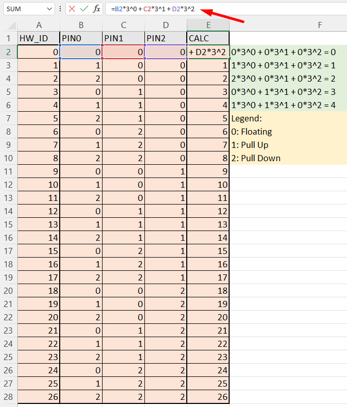
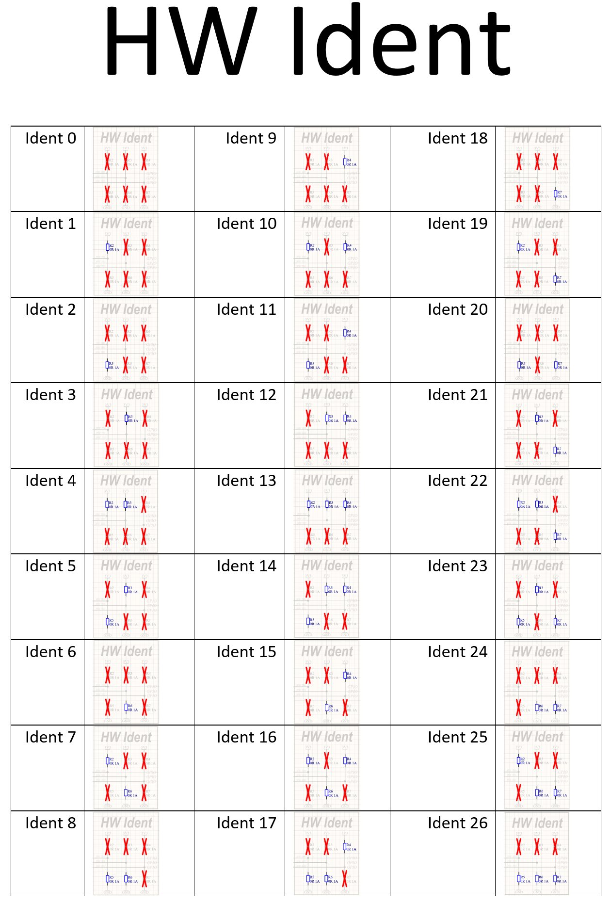
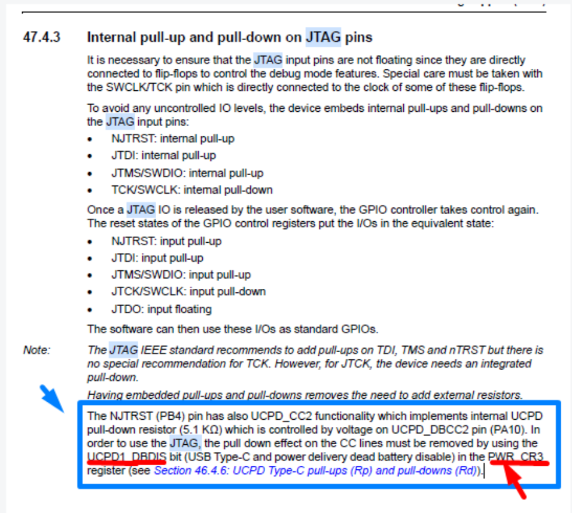

# Auralix C Library Wiki - ALX Id Module
---

## How to calculate HW_ID value
---
  


---
## How to resolve problem with pull down 5.1k on pin PB4
- Add ```LL_PWR_DisableUCPDDeadBattery();``` before ```id->Init();```

	```
	void Init(void) override
	{
		IDT_ID_ASSERT(isInit == false);
	
		// #1 Disable USB Type-C dead battery pull-down behavior on UCPD1_CC1 and UCPD1_CC2 pins.
		LL_PWR_DisableUCPDDeadBattery();
	
		// #2 Init Auralix ID
		id->Init();
	
		// #2 Set isInit
		isInit = true;
	}
	```

### *Note: Low level code is:*
---
- This must be included anywhere in code
```PWR->CR3 |= PWR_CR3_UCPD_DBDIS;```


